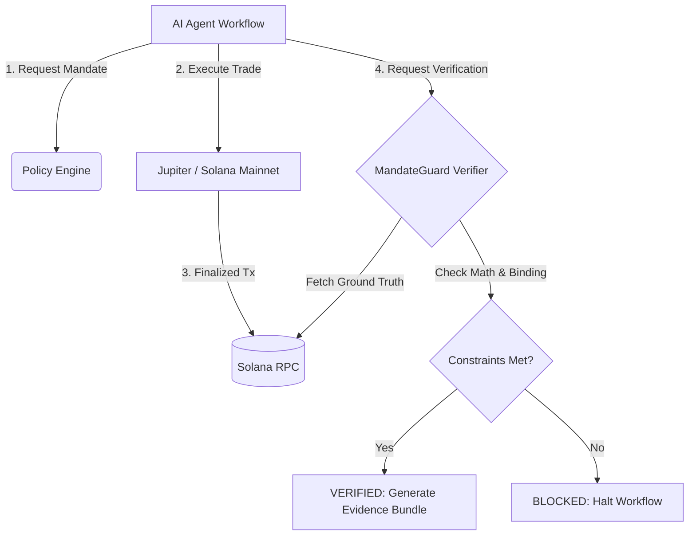

# MandateGuard 🛡️

[](https://github.com/kaulastudies/proofrail/actions/workflows/ci.yml)

**Trustless On-Chain Verification for Autonomous AI Agents.**

## The Problem (30 Seconds)
AI agents are increasingly executing on-chain transactions, but they operate as black boxes with blank checks. If an agent hallucinates, is prompt-injected, or gets exploited, it can drain a treasury or route funds to an attacker. Traditional limits rely on the agent policing itself—which means if the agent is compromised, the limits are compromised.

## The Solution (30 Seconds)
**MandateGuard** is a deterministic, zero-trust verification layer that binds an AI's predefined intent (a **Mandate**) to its actual signed on-chain execution using a canonical transaction memo. 

Before an autonomous agent is allowed to proceed to its next workflow step, MandateGuard independently fetches the finalized transaction from the Solana blockchain (bypassing the agent) and verifies that:
1. **Constraints were met:** Max input spent, min output received, and exact destination accounts match the mandate.
2. **Infrastructure is isolated:** Rent costs (e.g., first-time ATA creation) are strictly separated from token swap expenditure.
3. **No Replay Attacks:** A unique mandate nonce carried in the signed transaction memo binds the observed transaction to the specific mandate and prevents unrelated historical transactions from satisfying it.

If the agent goes out of bounds, MandateGuard returns a definitive **`BLOCKED`** status, halting the workflow before further damage occurs.

---

## ⚡ One-Command Demo (Zero SOL Required)

Want to see it in action without spending real SOL? We captured a real, finalized mainnet transaction and its resulting evidence. 

Run the deterministic demo to see how the exact same production verifier handles valid executions, replay attacks, and economic policy violations:

```bash
npm install
npm run demo
```

*(This runs the `scripts/demo.ts` script, passing the immutable RPC payload through the `SolanaVerifier` decision logic locally.)*

---

## 🧾 Judge-Facing Evidence Table

MandateGuard isn't a theoretical simulation. This system was tested with a live, funded transaction on Solana Mainnet using the Jupiter v2 API. 

| Metric | Value |
| :--- | :--- |
| **Transaction Signature** | [`67YtUCn89S...M6uifgnmY`](https://solscan.io/tx/67YtUCn89S2JfAdjfpmcRSk4FFbq8xnfRfYdo7z2oCdpPL9RTJuLQYccQRCKRdXcApJKKiXKhAzLRJ9M6uifgnmY) |
| **Mandate ID** | `live-mandate-001` |
| **Nonce** | `f4cd7ad3d83aecda` |
| **Raw Payload Hash** | `91382a835167c45ed533bb9ca5b36052c8ccc39a60c64f7e40facb145eaeace4` |
| **Verifier Version** | `v1.1` |
| **Live Result** | ✅ **`VERIFIED`** |
| **Replay Result** | ❌ **`BLOCKED`** (`missing_or_invalid_mandate_binding`) |
| **Policy Violation Result**| ❌ **`BLOCKED`** (`max_input_exceeded`) |

### Verify the Evaluation Before Trusting the Verdict
**A powerful note on our methodology:** During our live mainnet execution, the original verifier (`v1.0`) actually returned `FAILED_VERIFICATION`. Why? 
1. The swap automatically created a new Associated Token Account (ATA) for USDC, costing ~0.00148 SOL in rent. The verifier lumped this infrastructure cost into the trade input, failing the `max_input_exceeded` check.
2. The native SOL reserve check incorrectly compared the wallet's *balance delta* (a negative number) instead of the absolute post-balance.

**We did not sweep this under the rug.** We preserved the v1.0 failure, fixed the evaluator logic (isolating rent, checking absolute balances), added strict regression tests (23/23 passing), and replayed the *exact same immutable transaction* under Verifier `v1.1` to get a `VERIFIED` result. MandateGuard caught its own semantic flaws, proving it can deterministically isolate edge cases based on immutable on-chain ground truth.

---

## 🏗️ Architecture



## Why This Matters for Autonomous Agents
As Agents move from read-only copilots to autonomous on-chain actors, they need guardrails that exist **outside of their own context window**. MandateGuard provides a deterministic, cryptographic firewall between an agent's intent and its authorization to continue operating, establishing the foundation for secure, scalable agentic finance on Solana.


## Evidence Provenance

The judge-facing proof is the frozen live-mainnet fixture set under `scenarios/fixtures/live_*`, including the finalized RPC payload and verifier v1.1 evidence. Synthetic/demo evidence is not presented as live proof.

## Submission Resources

- [90-second demo script](docs/DEMO_SCRIPT.md)
- [Colosseum submission draft](docs/COLOSSEUM_SUBMISSION.md)
- [Phase 5 evaluation history](docs/PHASE5_EVALUATION_HISTORY.md)

